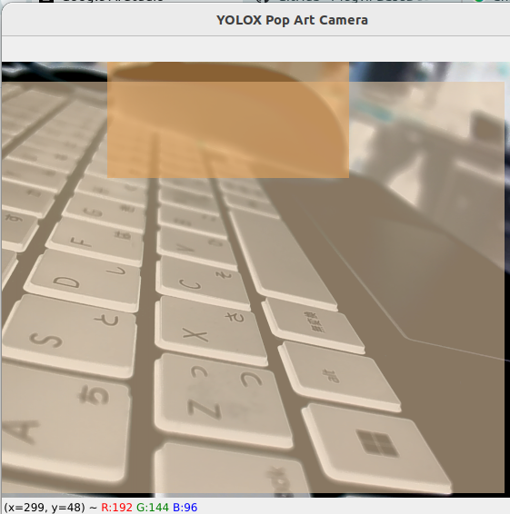

# negaposi_yolox
It is simple study toy cam

- A real-time camera application that uses the YOLOX object detection model to apply creative and artistic visual effects to detected objects and the background. The application features multiple modes that can be switched on the fly.

## Demo
(A GIF demonstrating the two modes would be highly effective here. It would show the camera view, a person or object being detected, and the user pressing the 'm' key to switch between the "YOLOX & Negative" mode and the "Mix Effect" mode.)

# Features
Real-Time Object Detection: Utilizes the high-performance YOLOX-L model to detect 80 different classes of objects from the COCO dataset.
YOLOX & Negative Mode: The default artistic mode. The entire camera feed is inverted (negated), and any detected objects are painted over with a vibrant, semi-transparent color gradient.
Mix Effect Mode: A motion-based effect that blends the current frame with the previous one, creating a dreamy, liquid-like afterimage trail.
Interactive Mode Switching: Instantly toggle between the two visual effects by pressing the m key.
GPU Acceleration: Automatically uses an NVIDIA GPU (via CUDA) if available for smooth, real-time performance, with a fallback to CPU.
## Requirements
- Python 3.8+
- PyTorch
- An NVIDIA GPU with CUDA is highly recommended for optimal performance.
- A webcam.
- Installation
- Clone the repository:

# module
- torch
- yolox
- opencv-python
- numpy

# Download the YOLOX Model:
- Download the pre-trained yolox_l.pth model weights from the official YOLOX repository.
- Download Link for YOLOX-L [YOLO X Page](https://pages.github.com/]().
- This site was built using [YOLO X Page]([https://pages.github.com/](https://github.com/Megvii-BaseDetection/YOLOX?tab=readme-ov-file)).
- Place the downloaded yolox_l.pth file in the root of the project directory.

# Keyboard Controls
m : Switch between "YOLOX & Negative Mode" and "Mix Effect Mode".
q : Quit the application.

# Configuration

You can easily tweak the visual effects by modifying the constants at the top of the yolox_popcam.py script:
CONF_THRESHOLD: Sets the confidence threshold for object detection (e.g., 0.4 means only detections with >40% confidence are shown).
NMS_THRESHOLD: The Non-Maximum Suppression threshold.
GRADIENT_ALPHA: Controls the transparency of the gradient overlay in YOLOX mode. 0.1 is very transparent, 0.9 is almost opaque.
MIX_ALPHA: Controls the strength of the afterimage in Mix mode. 0.95 creates a short trail, while 0.8 creates a much longer, more pronounced trail.

